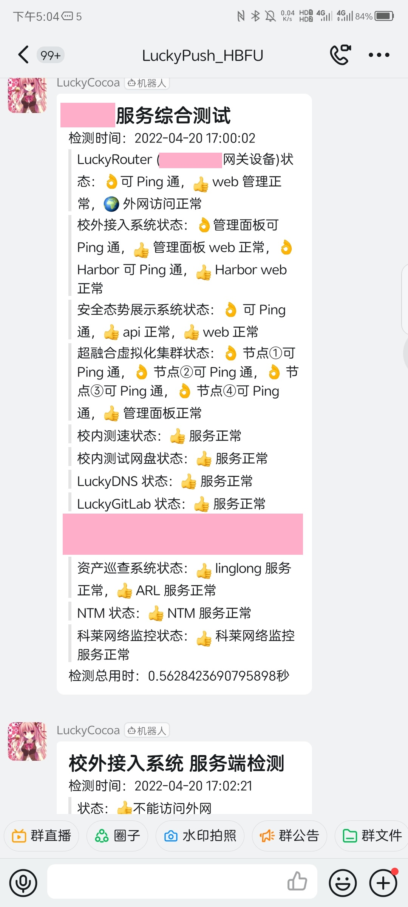
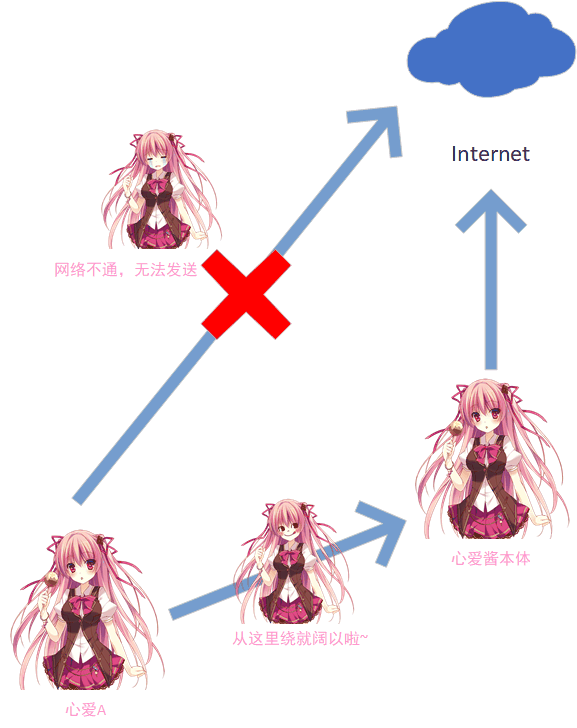
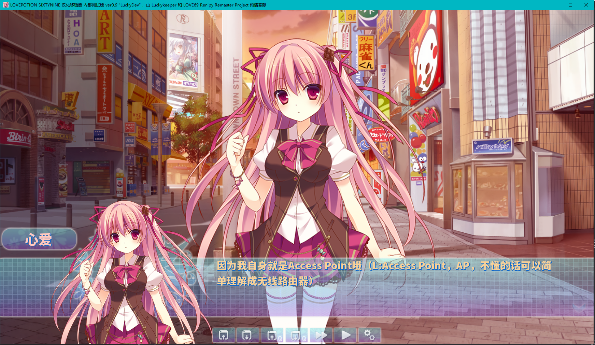
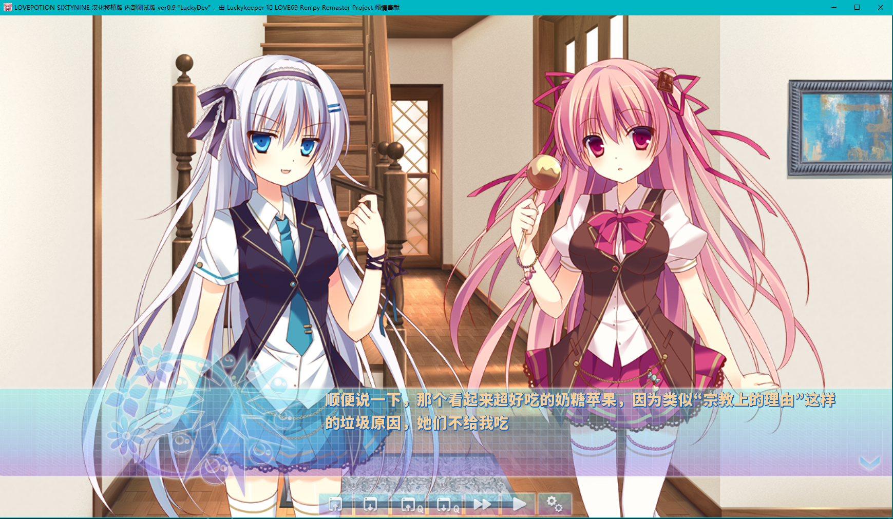
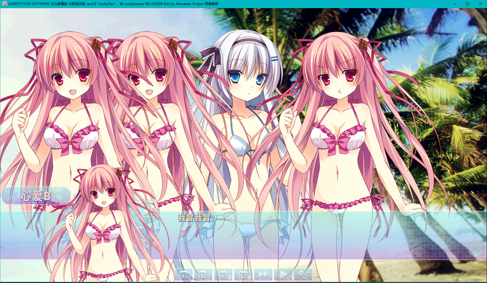

<h2 align="center">CocoaPush</h2>
<h3 align="center">心爱酱钉钉消息推送机器人，让可爱的心爱酱帮你照看各个设备的运行状态</h3>

    

------

# 功能简介和运行截图

心爱酱钉钉消息推送机器人，让可爱的心爱酱帮你照看各个设备的运行状态

有一个统一推送中心，只负责发送接收到的数据，其它设备发消息到推送中心，由推送中心向钉钉推送

> 运行截图如下，部分敏感信息已打码

# 架构和使用场景

见下图，校内存在多个服务，其中有一些机器不允许连接外网，需要持续监测服务运行状态和外网连接状态，于是就有了心爱酱机器人

# 各组件介绍

> 具体的使用方法还请看源码

## CocoaServer

> 心爱酱本体

- 依赖：DingtalkChatbot

心爱酱本体能够建立起和分身的连接，采用心爱酱本体监听，分身主动连接的方法，分身连接上之后阔以借助本体发送消息，因为

心爱酱本体会验证分身的真实性，如果对方不可信则会拒绝，像这样

## CocoaClient

> 心爱酱的分身

- 依赖：ping3（如果要ping机器的话需要这个） requests（一般默认有）

心爱酱是会分身的，像这样

这里心爱酱的分身分别写了使用 ping  检测设备是否在线、 socket 监听端口 、 requests 检测 WEB 服务的三种方法，你阔以根据需要进行改写

最后祝大家和心爱酱玩的愉快，上面展示图中心爱酱的头像已经放在 images/cocoa.png 了，把钉钉的默认机器人头像换成这个就行

